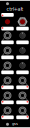

# CTRL+ALT

CTRL+ALT is a modular firmware and hardware platform for a STM8 microcontroller, focused on real-time audio, control voltage (CV), and lo-fi digital signal processing. It is designed for experimentation, eurorack synths and embedded control projects.

Currently, the framework comes with these example projects to help you get started and familiarise yourself on how to access the functionalities:
- blinky
- master clock
- sample & hold
- wavetable LFO

If you fork this repo and come up with your own cool program, feel free to contribute so that everyone can enjoy it!

## Getting Started

### Prerequisites

- [PlatformIO](https://platformio.org/) (for building and uploading firmware)
- [ctrl+alt](https://www.maxgenson.de/ctrl-alt/) eurorack module
- STM8 debug probe
- [VSCode](https://code.visualstudio.com/) (optional, but really good integration and generally recommended for this project)
- [VSCodium](https://vscodium.com/) (optional, PlatformIO not natively supported, however workaround [exists](https://www.kentoseth.com/posts/2023/mar/22/install-platformio-ide-in-vscodium-flatpak/))

### Getting Started

Install VSCode with PlatformIO Plugin (recommended) or the PlatformIO CLI tool.

```sh
$ git clone https://github.com/backtail/ctrl-alt
$ cd ctrl-alt
$ code . # open VSCode
```

All example projects are located in `src/programs/`.

### Building

Use the VSCode/Codium PIO task and set the right project/environment. (recommended)

or

```sh
$ pio run -e <project_name>
```

### Upload

Use the VSCode/Codium PIO task and set the right project/environment. (recommended)

or

```sh
$ pio run -e <project_name> -t upload
```

## The Complementary Hardware

This framework is made to run on the 6 HP wide CTRL+ALT eurorack module which can be found under `hardware/`.

It features:
- 3 logic inputs (threshold ~ 2.5V, 12V tolerable) + indicator LEDs
- 3 CV inputs (0V to 5V, 12V tolerable)
- 3 knobs
- up to 3 CV outputs (0V to 5V) or up to 3 logic outputs (0V or 5V) + indicator LEDs -> per output switchable via software
- 1 toggle switch
- 1 momentary button switch



## Contributing

Please read [CONTRIBUTING.md]() for details on our code of conduct, and the process for submitting pull requests to us.

### Authors

* **[Max Genson](https://www.maxgenson.de/)** - Engineer @ [KOMA Elektronik](https://koma-elektronik.com/new/about-shop/)

## License
The underlying hardware project source code is licensed under [CERN Open Hardware Licence Version 2 - Strongly Reciprocal](LICENSE_HARDWARE). 

Everything else, including the source code of the firmware for the CTRL+ALT hardware is licensed under [GPL-3.0](LICENSE_SOFTWARE).
